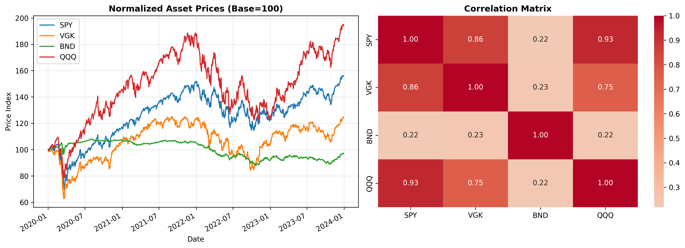

# Quantitative Risk & Return Optimizer 

A modular Python and R framework for asset allocation, downside risk estimation ($VaR$, $CVaR$), and SLSQP portfolio optimization using historical market data (`SPY`, `VGK`, `BND`, `QQQ`).

The project demonstrates an end-to-end quantitative workflow: fetching market data, optimizing asset weights under allocation constraints, generating risk visualizations, and auditing Python numerical outputs against R's `PerformanceAnalytics` library.

---

###  Portfolio Visual Analytics


---

## Core Features

* **Data Ingestion & Caching:** Automated market data retrieval via `yfinance` with local CSV caching in `data/` to avoid redundant API calls.
* **Portfolio Optimization:** SLSQP optimization using `SciPy` to construct Maximum Sharpe Ratio (MSR) and Minimum Conditional Value-at-Risk (Min-CVaR) portfolios under custom asset weight bounds ($0.05 \le w_i \le 0.60, \sum w_i = 1$).
* **Risk Analytics:** Historical calculation of $VaR_{95}$, $CVaR_{95}$ (Expected Shortfall), annualized Sharpe Ratio, and Maximum Drawdown.
* **Cross-Language Validation:** R verification script (`scripts/verify_metrics.R`) using `PerformanceAnalytics` to audit Python risk metric calculations.
* **Visual Analytics:** Automated rendering of normalized asset price performance and return correlation heatmaps in `outputs/`.

---

## Repository Structure

```text
.
├── data/                   # Cached historical CSV market data
├── outputs/                # Generated performance plots and correlation heatmaps
├── scripts/
│   └── verify_metrics.R    # Independent R validation script
├── src/
│   ├── __init__.py         # Package initialization
│   ├── data_loader.py      # Data retrieval and caching module
│   ├── risk_metrics.py     # VaR, CVaR, Sharpe, and Max Drawdown engine
│   ├── optimization.py     # SciPy SLSQP portfolio optimizer
│   └── visualization.py    # Plotting utilities
├── main.py                 # Main execution script
├── .gitignore              # Git exclusion rules
├── requirements.txt        # Python dependencies
└── README.md               # Project documentation
```

---

## Summary Results (2020–2024 Data)

* **Max Sharpe Strategy:** Achieved higher annualized return by allocating optimal weight to tech and broad market equity ETFs (QQQ, SPY).
* **Min CVaR Strategy:** Significantly reduced daily tail loss severity ($CVaR_{95}$) by shifting portfolio concentration into fixed income (BND).
* **R Audit Verification:** Python risk calculations match R `PerformanceAnalytics` outputs under identical historical return inputs.

---

## Key Takeaways & Design Decisions

* **Tail Risk Awareness:** Demonstrates why minimizing portfolio variance (volatility) differs from minimizing expected tail loss ($CVaR$) during market stress.
* **Cross-Language Interoperability:** Shows how Python optimization workflows can be cross-audited using R's specialized financial packages.
* **Clean Software Architecture:** Decouples data ingestion, mathematical risk modeling, numerical solvers, and visualization into reusable Python modules.

---

## Setup & Running

1. **Clone the repository:**
   ```bash
   git clone https://github.com/klepecvabicrok/Quantitative-Risk-Return-Optimizer.git
   
   cd Quantitative-Risk-Return-Engine-2026
   ```

2. **Install dependencies:**
   ```bash
   pip install -r requirements.txt
   ```

3. **Run the quantitative pipeline:**
   ```bash
   python main.py
   ```

4. **Run the independent R audit:**
   ```bash
   Rscript scripts/verify_metrics.R data/SPY.csv
   ```